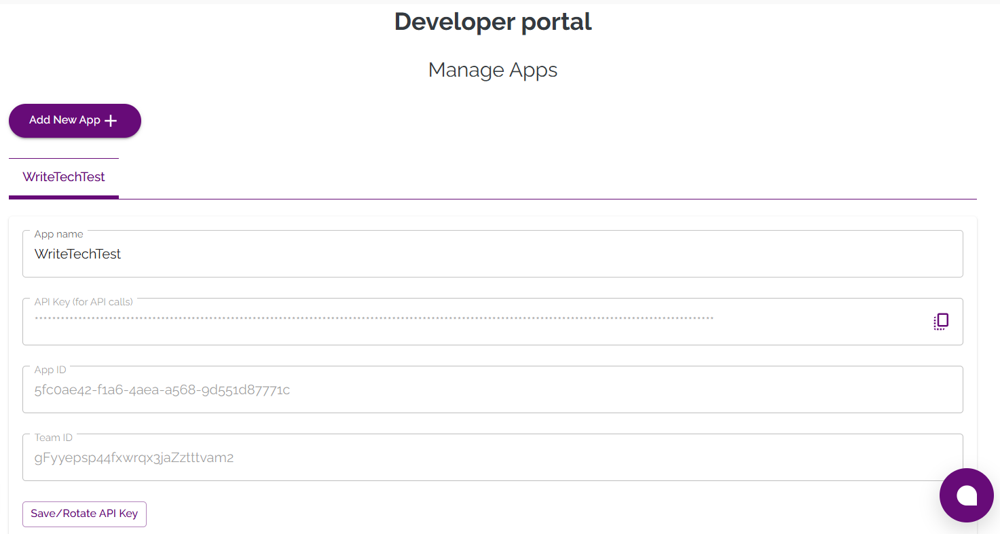
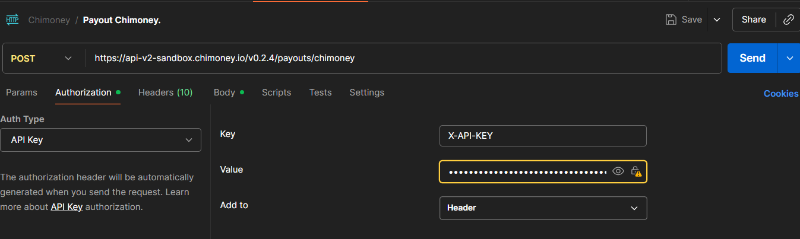

# Getting Started with Chimoney API (Sandbox)

This guide will help you set up and start testing the **Chimoney API v0.2.4** in the sandbox environment.

---

## API User Requirements

### **API Base URL**

`https://api-v2-sandbox.chimoney.io/v0.2.4`

This is the **sandbox (test)** environment.  
Use it for development and testing before moving to production.

---

### **Authentication Process**

Chimoney API uses **API keys** for authentication.

1. Log in to your [Chimoney Dashboard](https://chimoney.io/dashboard).
2. Navigate to **Developers → API Keys**.
3. Create and copy your **Sandbox API Key**.

   

4. Use it in your API request headers like this:

    Authorization: YOUR_API_KEY

> Keep your API key secure and never share it publicly.

---

### **Required Headers**

| Header | Type | Required | Description |
|--------|------|-----------|-------------|
| `Authorization` | string | Yes | Your Chimoney API key |
| `Content-Type` | string | Yes | Must be `application/json` |
| `Accept` | string | Optional | Recommended value: `application/json` |

### **Postman Request**

Use [Postman](https://www.postman.com/) to test Chimoney endpoints.

1. Open Postman

1. Create a new request

1. Set the method to **GET** or **POST**

1. Paste the URL (example): `https://api-v2-sandbox.chimoney.io/v0.2.4/info/assets`

>NOTE: paste the URL of the endpoint you want to test.

1. Under the Headers tab, add:

| Key | Value |
|----------|----------|
| Authorization | YOUR_API_KEY |
| Content-Type | application/json |

1. Click **Send**
