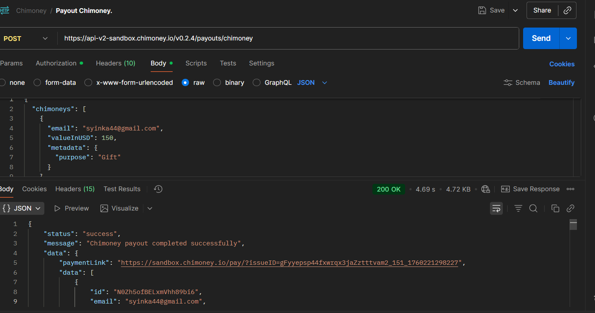

# Payouts Endpoint

**Method:** `POST`  
**Endpoint:** `/Payouts` — Chimoney  
**Base URL:**: `https://api-v2-sandbox.chimoney.io/v0.2.4/payouts/chimoney`

---

## Description

This endpoint is used to send ChiMoney payouts to one or more recipients using their email addresses.  
Each payout specifies the recipient's email, the amount (in USD), and  metadata (e.g. purpose or reference note).

---

## Testing Process (Using Postman)

1. **Open Postman** and click **New → Request**.  
1. Set the method to **POST** and paste the URL below:
`https://api-v2-sandbox.chimoney.io/v0.2.4/info/assets`

1. Click **Send**




## Request Body

| Field | Type | Required | Description |
|--------|-------|-----------|-------------|
| `chimoneys` | array |  Yes | List of payout objects containing email, valueInUSD, and optional metadata |
| `email` | string | Yes | Recipient’s email address |
| `valueInUSD` | number | Yes | Amount to send in USD |
| `metadata` | object | Optional | Custom data such as purpose or reference information |

**Request Body:**

```json
{
  "chimoneys": [
    {
      "email": "syinka44@gmail.com",
      "valueInUSD": 150,
      "metadata": {
        "purpose": "Gift"
      }
    }
  ]
}
```

**JSON Response:**

```json
{
  "status": "success",
  "message": "Chimoney payout completed successfully",
  "data": {
    "paymentLink": "https://sandbox.chimoney.io/pay/?issueID=gFyyepsp44fxwrqx3jaZztttvam2_151_1760219480691",
    "data": [
      {
        "id": "0lkBjJqxTNDasFLci7Ru",
        "email": "syinka44@gmail.com",
        "valueInUSD": 150,
        "metadata": { "purpose": "Gift" },
        "chimoney": 150000,
        "chiRef": "b3c82184-fad0-44cf-b4af-ac8c2a897fe5",
        "status": "paid",
        "redeemLink": "https://sandbox.chimoney.io/redeem/?chi=b3c82184-fad0-44cf-b4af-ac8c2a897fe5"
      }
    ],
    "error": "None"
  }
}
```