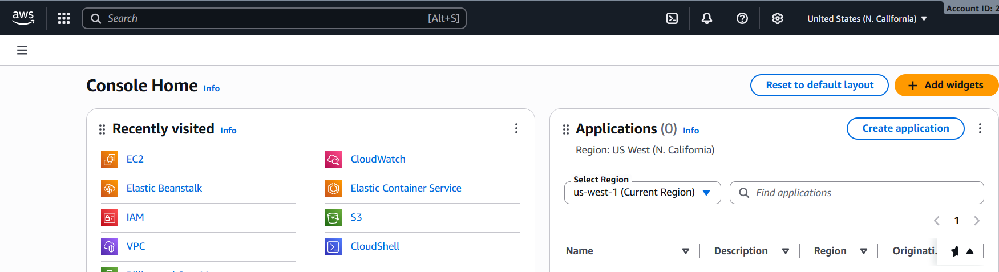
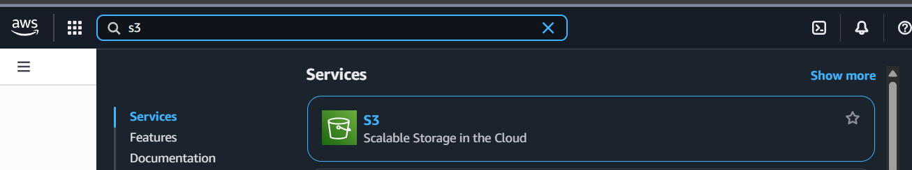

# Setup and Configuration

Before you start working with Amazon S3, make sure you have the following:

## Prerequisites

- An [AWS Account](https://aws.amazon.com/).  
- Access to the **AWS Management Console**.  

## Steps

1. **Log in to AWS Console**  
   Go to [AWS Console](https://console.aws.amazon.com/) and sign in.  

1. **Search for S3**  
   In the top search bar, type `S3` and click the service.  

   
  
  > **NOTE**: If you’re not using the root account, make sure your IAM user has at least:
  >
  > - `s3:CreateBucket`
  > - `s3:PutObject`
  > - `s3:GetObject`
  >
  > Use IAM user for best practice.
