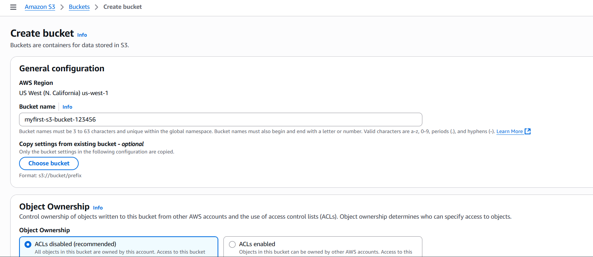
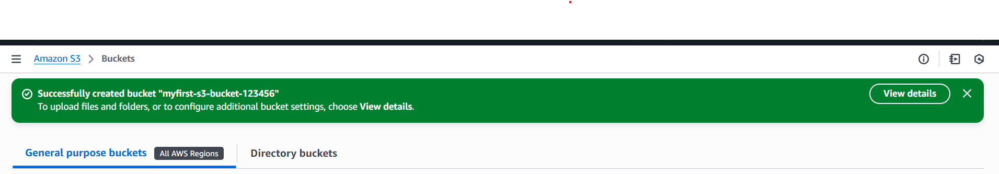
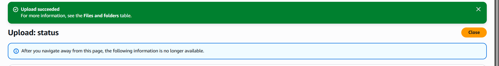
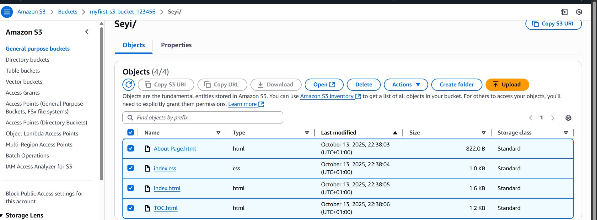

# Step-by-Step Guide: Using AWS S3

---

## Create Your First S3 Bucket

1. In the AWS Console, go to **Services → S3**.  
2. Click **Create bucket**.  
3. Enter a unique name (e.g., `myfirst-s3-bucket-123456`).  
4. Choose a region near you.

   

5. Leave other options default → click **Create bucket**.  

    

---

## Upload a File

1. Open your new bucket.  
2. Click **Upload → Add files or folder**.  
3. Select a file (e.g., `index.html` , `name.css`).  or select a folder that has the files you want to uplaod
4. Click **Upload**.

   

You should see your file screen

---

## Host a Static Website

1. Upload `index.html` and `file.css` files.  
2. Go to **Properties → Static website hosting**.  
3. Enable it and set `index.html` as the default file.  
4. Copy the website endpoint URL.

## Terminate Resources

It is best practice to delete resources after use on AWS.

To-do:

1. Delete the uploaded files from the s3 bucket
2. Delete the s3 bucket created.
